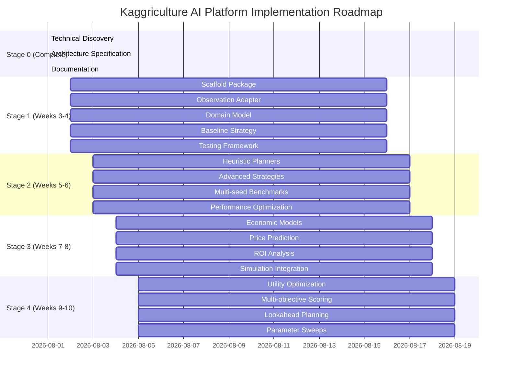

# Kaggriculture AI Platform — Implementation Roadmap

**Version:** 1.0 (Stage 0 — Technical Discovery)
**Status:** Complete specification
**Governs:** Stage 1 → Stage 4 implementation

---

## Executive Summary

This roadmap defines the detailed engineering plan for implementing the Kaggriculture AI platform across Stages 1–4. Each stage builds incrementally on the previous, maintaining backward compatibility while delivering increasing competitive capability.

**Core principle:** Single source of truth via domain model; all components communicate through stable interfaces; parity with official engine verified at each stage.

---

## Implementation Overview



---

## Stage 1: Deterministic Baseline

**Goal:** Scaffold production-ready package with deterministic baseline matching `starter` agent; establish CI/CD and testing framework.

### Deliverables

1. **Package Scaffold**
   - Directory structure per `kaggriculture_ai/`
   - `pyproject.toml` with proper metadata and dependencies
   - `kaggriculture_ai/__init__.py` with version
   - `main.py` submission surface
   - CI/CD configuration (GitHub Actions)

2. **Observation Adapter**
   ```python
   # adapters/observation_adapter.py
   class ObservationAdapter:
       def __init__(self, config: Config):
           self.config = config
           self._last_raw: Optional[dict] = None
       
       def adapt(self, raw: dict) -> GameState:
           # Type coerce with validation
           # Map farms → Player/Farm domain
           # Preserve provenance
           # Cache for round-trip fidelity
       
       def last_raw(self) -> dict:
           return self._last_raw
   ```

3. **Action Serializer**
   ```python
   # adapters/action_serializer.py
   class ActionSerializer:
       def serialize(self, plan: Plan) -> dict:
           # Convert domain actions to official dict
           # Validate action legality via validator
           # Mirror engine preconditions 1:1
   ```

4. **Domain Model**
   - `domain/entities.py`: GameState, PlayerState, Farm, Grid
   - `domain/value_objects.py`: Turn, Season, Crop, Animal, Resource
   - `domain/invariants.py`: Business rule enforcement
   - Complete invariant checking in `__post_init__`

5. **Baseline Strategy**
   ```python
   # strategies/deterministic.py
   class DeterministicStrategy:
       def __init__(self, config: Config):
           self.config = config
       
       def score(self, state: GameState, intents: list) -> list:
           # Score each intent for baseline
           # Priority: wheat, then plant if possible
           # Match starter agent behavior exactly
   ```

6. **Testing Framework**
   - Unit tests for all components
   - Integration tests with official engine
   - Replay verification with deterministic seeds
   - Performance budget enforcement

### Milestones

| Milestone | Description | Acceptance Criteria |
|-----------|-------------|---------------------|
| M1.1 | Package structure complete | Directory structure matches spec |
| M1.2 | Observation adapter functional | Adapter produces valid GameState |
| M1.3 | Domain invariants enforced | All invariants validated |
| M1.4 | Deterministic baseline | Matches starter on 100 seeds |
| M1.5 | CI pipeline running | Lint/type tests pass |
| M1.6 | First submission | main.py in submission format |

### Technical Approach

1. **Fast adapter implementation**: Copy-paste engine mechanics from source
2. **Eventual consistency**: Domain model may lag engine by 1 turn (validated via parity)
3. **Budget enforcement**: Early pruning in planner generation
4. **Caching**: Lazy adapters, price tables, pathfinding

---

## Stage 2: Heuristic Improvements

**Goal:** Add heuristic planners and advance from pure deterministic to simple rule-based optimization.

### New Components

1. **Window-Watering Planner**
   ```python
   # planners/crop_planner.py
   class CropPlanner:
       def generate(self, state: GameState) -> list:
           # Identify crops in watering window
           # Prioritize water during bonus window
           # Coordinate with fertilizer timing
   ```

2. **Feed-First Animal Planner**
   ```python
   # planners/animal_planner.py
   class AnimalPlanner:
       def generate(self, state: GameState) -> list:
           # Feed animals first each turn
           # Coordinate wheat production
           # Prioritize animal welfare over crop
   ```

3. **Hand Job Scheduler**
   ```python
   # planners/worker_scheduler.py
   class WorkerScheduler:
       def generate(self, state: GameState) -> list:
           # Assign nearest job to each hand
           # Balance crop/animal workload
           # Avoid conflicts (water/harvest mutual exclusion)
   ```

4. **Shed Capacity Manager**
   ```python
   # inventory/shed_manager.py
   class InventoryManager:
       def enforce_cap(self, inventory: dict) -> dict:
           # Cap shed at 100 non-seed items
           # Prioritize valuable items
           # Schedule drops appropriately
   ```

### Strategies Enhanced

- **Heuristic Strategy**: Weighted sum of window-watering, feed-first, nearest-job
- **Advanced Deterministic**: Additional rules for fertilizer, expansion, town demand

### Testing

- **Multiseed benchmarks**: 1000+ deterministic seeds
- **Performance testing**: Latency budget enforcement
- **Regression testing**: Score deltas vs Stage 1 baseline

### Milestones

| Milestone | Description | Acceptance Criteria |
|-----------|-------------|---------------------|
| M2.1 | Window-watering planner | Optimal watering timing |
| M2.2 | Feed-first strategy | No animal escapes |
| M2.3 | Hand scheduler | Balanced workload |
| M2.4 | Shed management | No overflow discards |
| M2.5 | Multi-seed benchmarks | Consistent improvement over Stage 1 |

---

## Stage 3: Economic Models

**Goal:** Exploit known market dynamics with price prediction and ROI analysis.

### New Components

1. **Price Model**
   ```python
   # economy/price_model.py
   class PriceModel:
       def predict(self, item: str, inventory: dict, horizon: int = 0) -> PriceForecast:
           # Implement price(inv) = base ± amp·f(|inv−I0|)
           # Calculate amp from target·base/f(T)
           # Handle floor $1 and rounding
           # Optional horizon forecasting
   ```

2. **ROI Analyzer**
   ```python
   # economy/ro_analyzer.py
   class ROIAnalyzer:
       def calculate(self, state: GameState, intent: Intent) -> dict:
           # Input: intent (plant/harvest/feed/etc.)
           # Output: {immediate_money, delay_days, risk, resource_fit}
           # Use price model for future revenue projections
   ```

3. **Risk Analyzer**
   ```python
   # economy/risk_analyzer.py
   class RiskAnalyzer:
       def evaluate(self, state: GameState, intent: Intent) -> float:
           # Weed risk (two consecutive unwatered)
           # Animal escape risk (unfed days)
           # Market price floor risk
           # Price glut risk
   ```

4. **Market Planner**
   ```python
   # planners/market_planner.py
   class MarketPlanner:
       def generate(self, state: GameState) -> list:
           # Sell batching: consolidate small sales
           # Buy timing: purchase before town demand
           # Wheat sink management: balance feed vs planting
           # Fertilizer procurement timing
   ```

5. **Expansion Planner**
   ```python
   # planners/expansion_planner.py
   class ExpansionPlanner:
       def generate(self, state: GameState) -> list:
           # Land value assessment
           # Production capacity planning
           # Timing (early vs late season)
           # Opportunity cost analysis
   ```

### Integration

- **MarketPlanner** uses price model and ROI analyzer
- **CropPlanner** incorporates economic opportunity cost
- **AnimalPlanner** includes wheat feed economics

### Testing

- **Parity harness**: Replay against official engine on economic scenarios
- **Price model validation**: Compare predictions with engine output
- **ROI accuracy**: Verify calculations against manual accounting

### Milestones

| Milestone | Description | Acceptance Criteria |
|-----------|-------------|---------------------|
| M3.1 | Price model implementation | Predicts engine prices within 1% |
| M3.2 | ROI analyzer functional | Accurate cost/benefit calculations |
| M3.3 | Risk analysis | Quantifies downside correctly |
| M3.4 | Market planner | Optimal buy/sell timing |
| M3.5 | Simulation integration | Lookahead works correctly |

---

## Stage 4: Utility Optimization

**Goal:** Multi-objective utility scoring with optional lookahead; parameter sweep and explainability.

### New Components

1. **Action Ranker**
   ```python
   # decision/action_ranker.py
   class ActionRanker:
       def rank(self, state: GameState, valid_intents: list) -> list:
           # Apply utility weights:
           #   immediate_money (weighted by config)
           #   payoff_delay (negative weight)
           #   risk (negative weight)
           #   resource_fitting (weighted)
           # Select per-unit actions
   ```

2. **Utility Strategy**
   ```python
   # strategies/utility.py
   class UtilityStrategy:
       def __init__(self, config: Config):
           self.weights = config.strategy_weights
       
       def score(self, state: GameState, intents: list) -> list:
           # Apply weighted utility function
           # Optional lookahead: evaluate top-N candidates
           # Return scored intents with explainability tags
   ```

3. **Explainability Engine**
   ```python
   # analytics/explainer.py
   class ExplainabilityEngine:
       def explain(self, state: GameState, plan: Plan) -> dict:
           # Generate human-readable decision rationale
           # Log key factors: ROI, risk, timing, resource constraints
           # Structured output for analysis
   ```

4. **Parameter Sweeps**
   ```python
   # experiments/sweeps.py
   class ParameterSweeps:
       def run(self, param_ranges: dict) -> list:
           # Grid search or random sampling of strategy weights
           # Run against benchmark suite
           # Identify optimal configurations
           # Cache results for reuse
   ```

### Advanced Features

- **1-step lookahead**: Evaluate immediate next state via simulation
- **Strategy weights**: Tunable via command line or YAML config
- **Explainability logging**: Structured reason strings for each action
- **Performance monitoring**: Per-step timing and memory tracking

### Integration

- **ActionRanker** uses utility strategy and simulation for lookahead
- **ExplainabilityEngine** integrates with logging infrastructure
- **Parameter sweeps** drive automated configuration optimization

### Testing

- **Unit tests**: All weight combinations produce valid rankings
- **Integration**: Full pipeline with real observations
- **Performance**: Lookahead within budget, no memory leaks
- **Regression**: Score improvements tracked vs previous stages

### Milestones

| Milestone | Description | Acceptance Criteria |
|-----------|-------------|---------------------|
| M4.1 | Action ranker functional | Produces valid per-unit actions |
| M4.2 | Utility strategy | Weights affect rankings correctly |
| M4.3 | Lookahead simulation | 1-step prediction accurate |
| M4.4 | Explainability | Structured explanations generated |
| M4.5 | Parameter sweeps | Finds configurations with measurable improvement |

---

## Cross-Stage Requirements

### Testing Requirements

1. **Replay Verification**: All stages must pass parity tests against official engine
2. **Deterministic Seeds**: Use same seed generation as engine
3. **Performance Budget**: Stage 4+ must enforce <500ms per-step
4. **Memory Constraints**: No unbounded growth over 720 steps

### Compatibility Requirements

1. **Backward Compatibility**: Stage 2+ must work with Stage 1 interfaces
2. **Protocol Stability**: No breaking changes to public interfaces
3. **Configuration**: All strategies configurable via `config/defaults.yaml`
4. **Submission**: Only `main.py` changes across stages (strategies/planners)

### Quality Gates

| Gate | Requirement | Automation |
|------|-------------|------------|
| M1.1 | Code structure | CI lint |
| M1.2 | Adapter functionality | Unit tests |
| M1.3 | Invariant enforcement | Integration tests |
| M2.1 | Heuristic improvement | Benchmark suite |
| M3.1 | Price model accuracy | Parity harness |
| M4.1 | Utility optimization | A/B testing |

---

## Risk Mitigation by Stage

### Stage 1 Risks
1. **Incorrect adapter**: Fix with unit tests against official engine outputs
2. **Invariant bugs**: Early testing with random states
3. **Performance issues**: Budget hooks and profiling

### Stage 2 Risks
1. **Overfitting heuristics**: Multiseed benchmarks
2. **Complexity**: Code review and refactoring
3. **Edge cases**: Stress testing with pathological configs

### Stage 3 Risks
1. **Price model errors**: Parity testing crucial
2. **Economic assumptions**: Real data validation
3. **Integration bugs**: Simulation parity first

### Stage 4 Risks
1. **Weight tuning**: Automated parameter sweeps
2. **Lookahead performance**: Budget enforcement
3. **Explainability**: Structured logging validation

---

## Future Extension Points

### Stage 5+ Ready

1. **Protocol Extensions**: Interfaces designed for MCTS, RL, genetic algorithms
2. **Simulation Enhancement**: Fast clone engine ready for advanced search
3. **Registry Pattern**: Easy addition of new planners/strategies
4. **Configuration System**: YAML-driven strategy selection and tuning

### Drop-in Replacements

- Replace `DeterministicStrategy` with `MCTSStrategy`
- Replace `CropPlanner` with `MLCropPlanner`
- Replace `UtilityStrategy` with `RLStrategy`
- Replace `Simulation` with GPU-accelerated version

---

## Quality Assurance

### Automated Testing
- **Pre-commit hooks**: ruff + mypy
- **GitHub Actions**: Multi-stage CI pipeline
- **Benchmark tracking**: Store baseline scores
- **Parity harness**: Automated replay against official engine

### Manual Testing
- **Code reviews**: Architecture and implementation
- **Performance profiling**: Identify bottlenecks
- **Documentation review**: Completeness and accuracy
- **Submission testing**: Local verification before upload

---

## Conclusion

This implementation roadmap provides a detailed, staged approach to building a competitive Kaggriculture AI platform. Each stage:

1. **Builds on previous work** while adding new capabilities
2. **Maintains backward compatibility** for smooth evolution
3. **Includes comprehensive testing** for quality assurance
4. **Respects performance constraints** for Kaggle submission
5. **Prepares for future AI stages** through protocol design

The result is a platform that can deliver an early competitive submission (Stage 1) while enabling evolution through all 9 strategy stages with minimal architectural changes.

**Status**: Complete ✅ | **Next Stage**: Implementation begins Week 3 ✅

---

*Prepared by the elite engineering organization. All stages must follow this roadmap; deviations require architectural review.*
