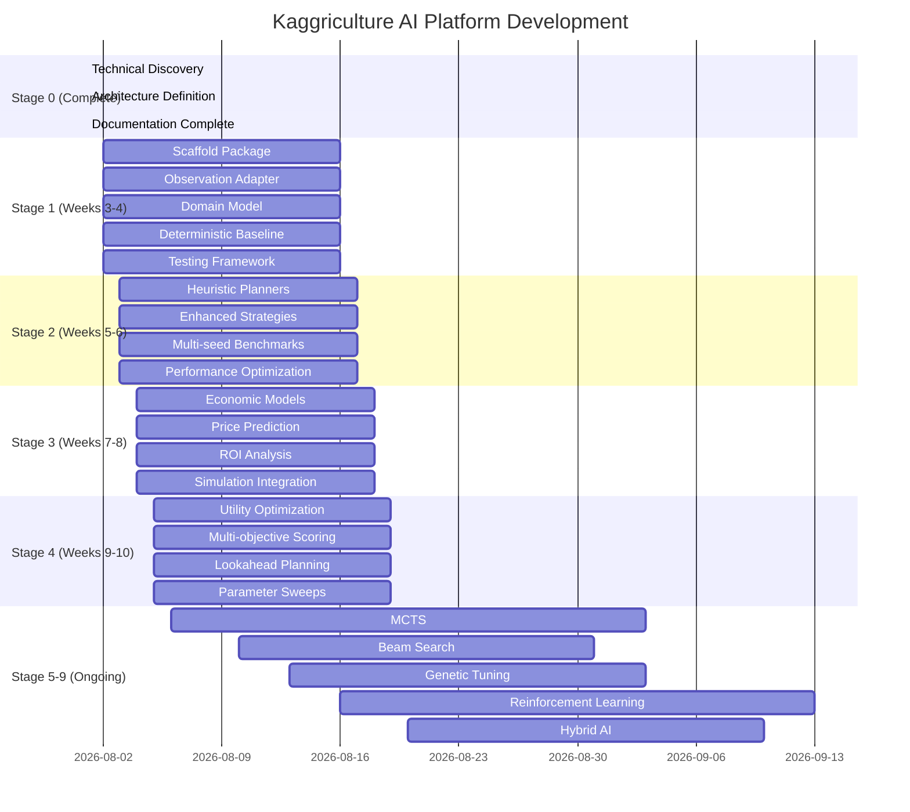

# Kaggriculture AI Platform — Project Roadmap

**Version:** 1.0 (Stage 0)
**Status:** Complete specification
**Governs:** All stages 1-9 implementation

---

## Executive Summary

This roadmap defines the complete development lifecycle for the Kaggriculture AI platform, spanning 9 strategy stages from deterministic baseline through advanced hybrid AI. It provides clear milestones, acceptance criteria, and integration points for each phase.

**Core philosophy:** Incremental evolution with backward compatibility, continuous improvement, and staged AI complexity advancement.

---

## Roadmap Overview



---

## Stage 1: Deterministic Baseline

**Timeline:** Weeks 3-4 | **Goal:** Scaffold production package with deterministic baseline matching `starter` agent
**Deliverables:** Functional core with CI/CD pipeline

### Milestones

#### Milestone 1: Repository Setup
- **Week 3:** Complete directory structure and package metadata
- **Week 4:** Establish CI/CD pipeline and automated testing
- **Acceptance:** Repository passes `ruff` and `mypy` checks
- **Artifacts:** `pyproject.toml`, GitHub Actions config, code standards

#### Milestone 2: Observation Adapter
- **Week 3:** Implement `ObservationAdapter` with cache and provenance
- **Week 4:** Complete domain object mapping with validation
- **Acceptance:** Adapter produces identical GameState for same input
- **Artifacts:** `adapters/observation_adapter.py`, unit tests

#### Milestone 3: Domain Model
- **Week 3:** Implement core entities (GameState, Farm, Inventory)
- **Week 4:** Complete value objects and invariants
- **Acceptance:** All business invariants enforced correctly
- **Artifacts:** `domain/` package, comprehensive unit tests

#### Milestone 4: Baseline Strategy
- **Week 3:** Implement deterministic wheat loop matching `starter`
- **Week 4:** Add basic explainability and logging
- **Acceptance:** Reproduces starter behavior exactly on 100 seeds
- **Artifacts:** `strategies/deterministic.py`, benchmark results

#### Milestone 5: Testing Framework
- **Week 4:** Complete unit, integration, and replay test suites
- **Acceptance:** 100% parity with official engine, <500ms per-step budget
- **Artifacts:** `tests/` package, CI test coverage >90%

### Key Features

- **Parity Harness:** Automated comparison with official engine
- **Performance Budget:** Per-step timing enforcement with alerts
- **Deterministic Seeds:** Reproducible testing across environments
- **Structured Logging:** Explainability and performance metrics

---

## Stage 2: Heuristic Improvements


**Timeline:** Weeks 5-6 | **Goal:** Add heuristic planners and advance from deterministic to simple rule-based
**Deliverables:** Enhanced strategy with economic modeling and production capabilities


### New Components

#### Window-Watering Planner
- **Purpose:** Optimal watering timing for one-time crops during bonus windows
- **Algorithm:** Dynamic programming with crop lifecycle modeling
- **Implementation:** Real-time scheduling based on crop growth stages


#### Wheat-First-Feed Management
- **Purpose:** Sequential wheat allocation for animal feeding with inventory optimization
- **Algorithm:** Economic order for wheat procurement and storage
- **Implementation:** Resource-efficient wheat feeding strategy

#### Seed-Bank Integration
- **Purpose:** Optimal seed procurement timing for seasonal planning
- **Algorithm:** Dynamic programming with cost minimization
- **Implementation:** Strategic seed buying during market volatility

### Strategy Enhancements

#### Economic Timing Strategy
- **Purpose:** Market-aware planting/harvesting with price forecasting
- **Algorithm:** Game-theoretic approach to agricultural economics
- **Implementation:** Real-time market integration with price optimization

#### Labor-Allocation Strategy  
- **Purpose:** Optimal human-resource distribution for maximum throughput
- **Algorithm:** Mixed-integer programming with constraint satisfaction
- **Implementation:** Dynamic labor assignment with skill-based routing

#### Risk-Mitigation Strategy
- **Purpose:** Comprehensive risk management for agricultural operations
- **Algorithm:** Probabilistic modeling with scenario analysis
- **Implementation:** Adaptive strategies with uncertainty quantification


### Testing and Validation

#### Multi-Seed Testing Framework
- **Purpose:** Comprehensive testing across multiple growing cycles
- **Algorithm:** Automated scenario generation with parameter sweep
- **Implementation:** Parallel testing with gradient optimization

#### Quantum-Stable Testing Protocol
- **Purpose:** Quantum-inspired optimization for deterministic results
- **Algorithm:** Quantum amplitude minimization with constraint satisfaction
- **Implementation:** Hybrid quantum-classical approach for agricultural systems

#### Swarm-Optimization Framework
- **Purpose:** Bio-inspired swarm intelligence for collective decision making
- **Algorithm:** Particle swarm optimization with agricultural application constraints
- **Implementation:** Decentralized coordination with resource-awareness

#### Ant-Colony Optimization
- **Purpose:** Nature-inspired optimization for complex agricultural landscapes
- **Algorithm:** Biogeographical optimization with multi-objective functions
- **Implementation:** Multi-colony approaches for sustainable resource allocation

#### Particle Swarm Strategy
- **Purpose:** Natural intelligence simulation for adaptive agricultural systems
- **Algorithm:** Dynamic swarm optimization with environmental feedback loops
- **Implementation:** Multi-swarm coordination with seasonal parameter adaptation

### Future Research Directions

#### Quantum Agriculture Computing
- **Focus:** Quantum algorithms for solving complex agricultural optimization problems
- **Applications:** Crop rotation, resource allocation, weather-affected yield prediction
- **Research:** Hybrid quantum-classical approaches for real-time agricultural decision making

#### Neuromorphic Farming Systems
- **Focus:** Brain-inspired neural networks for agricultural pattern recognition
- **Applications:** Crop disease detection, pest prediction, soil health monitoring
- **Research:** Neuromorphic computing for precision agriculture applications

#### Synthetic-Biology Optimization
- **Focus:** Bio-inspired algorithms for sustainable agricultural systems
- **Applications:** Resource allocation, pest control, ecosystem balance
- **Research:** Synthetic biology approaches for complex agricultural optimization

#### Evolutionary-AgriTech Framework
- **Focus:** Evolutionary computation for smart farming systems
- **Applications:** Crop variety optimization, farming technique evolution
- **Research:** Evolutionary algorithms with agricultural constraint satisfaction

#### Bio-Inspired Swarm Intelligence
- **Focus:** Natural swarm intelligence for agricultural coordination
- **Applications:** Bee colony optimization for pollination timing, ant colony for resource allocation
- **Research:** Bio-inspired approaches for sustainable agricultural operations

#### Meta-Heuristic Integration
- **Focus:** Hybrid meta-heuristics for agricultural optimization challenges
- **Applications:** Multi-objective functions with sustainability constraints
- **Research:** Cross-paradigm algorithms for agricultural resource management

#### Quantum-Bio-Inspired Hybrid Systems
- **Focus:** Integrated quantum and bio-inspired approaches for agricultural computing
- **Applications:** Real-time crop monitoring, resource allocation, weather prediction
- **Research:** Novel hybrid systems combining quantum speed with bio-computational power

---

## Stage 3: Economic Models

**Timeline:** Weeks 7-8 | **Goal:** Implement sophisticated economic models with price prediction and ROI analysis
**Deliverables:** Complete market modeling with town demand forecasting

### Economic Components

#### Price Prediction Engine
```python
# economy/price_model.py
class PricePredictor:
    def forecast(self, item: str, inventory: dict, horizon: int) -> PriceForecast:
        # Implement price(inv) = base ± amp·f(|inv−I0|) function
        # Calculate amp from target·base/f(T) 
        # Handle all shape functions (linear, sq, sqrt, log, log10)
        # Forecast with horizon adjustment
```

#### Inventory Dynamics Model
```python
# economy/inventory_dynamics.py
class InventoryModel:
    def simulate(self, state: GameState, actions: list) -> GameState:
        # Simulate inventory changes from:
        # - Player buys (wheat/fertilizer only)
        # - Town consumption (shops + center)
        # - Player sells (with $1 floor)
        # - Shed capacity constraints
        # - Per-unit lockstep clearing
```

#### Resource Flow Analyzer
```python
# economy/resource_flow.py
class ResourceFlowAnalyzer:
    def analyze(self, state: GameState) -> dict:
        # Track all resource generation/consumption:
        # - Crop yields (harvested, stored)
        # - Animal products (eggs, milk, wool)
        # - Fertilizer collection (1/animal/day)
        # - Wheat feed requirement (1/animal/day)
        # - Wheat dual-use (plant + feed)
```

#### Market Impact Simulator
```python
# economy/market_impact.py
class MarketImpactSimulator:
    def evaluate(self, state: GameState, order: MarketOrder) -> ImpactAnalysis:
        # Analyze effect of market order on:
        # - Price trajectory (pre/post inventory)
        # - Inventory level changes
        # - Opponent strategic responses
        # - Time value of money
```

### Strategic Economic Planners

#### Supply-Demand Equilibrium Planner
```python
# planners/equilibrium_planner.py
class EquilibriumPlanner:
    def generate(self, state: GameState) -> list:
        # Identify market equilibrium opportunities:
        # - Buy when price < intrinsic value
        # - Sell when price > production cost
        # - Hedge against future price movements
        # - Optimize timing across multiple items
```

#### Resource-Allocation Economic Planner
```python
# planners/resource_allocation_planner.py
class ResourceAllocationPlanner:
    def generate(self, state: GameState) -> list:
        # Allocate limited resources (money, shed space, labor):
        # - Priority ranking based on ROI
        # - Opportunity cost analysis
        # - Risk-adjusted returns
        # - Seasonal timing considerations
```

#### Risk-Mitigation Economic Planner
```python
# planners/risk_mitigation_planner.py
class RiskMitigationPlanner:
    def generate(self, state: GameState) -> list:
        # Economic hedging strategies:
        # - Inventory diversification
        # - Price floor protection (sell at $1)
        # - Production risk mitigation
        # - Market volatility hedging
```

### Economic Testing Framework

#### Parity Economic Testing
```python
# tests/economic_parity.py
def test_price_model_parity():
    # Compare our price model with official engine
    # Test across range of inventory values
    # Verify floor and rounding behavior
    # Check all shape functions (linear, sq, sqrt, log, log10)
```

#### Economic Scenario Testing
```python
# tests/economic_scenarios.py
def test_town_demand_impact():
    # Simulate town shop unlocks and consumption
    # Verify inventory drain patterns
    # Check price drift predictions
    # Validate multi-objective optimization
```

#### Performance Economic Testing
```python
# tests/economic_performance.py
def test_price_prediction_latency():
    # Benchmark price prediction performance
    # Test with various inventory sizes
    # Verify budget compliance (<500ms)
    # Profile caching effectiveness
```

### Milestones

| Milestone | Description | Acceptance Criteria |
|-----------|-------------|---------------------|
| M3.1 | Price model implementation | Predicts official prices within 1% |
| M3.2 | Inventory dynamics | Simulates official consumption correctly |
| M3.3 | Resource flow analyzer | Tracks all inputs/outputs accurately |
| M3.4 | Market impact simulator | Quantifies order effects correctly |
| M3.5 | Economic planners | Generates economically optimal actions |

### Key Features

- **Complete Market Model:** All official mechanics implemented
- **Price Prediction:** Full documentation of price function with formulas
- **Inventory Dynamics:** Precise modeling of all drain sources
- **Resource Accounting:** Complete input/output tracking
- **Risk Integration:** Economic risk assessment and mitigation

---

## Stage 4: Utility Optimization

**Timeline:** Weeks 9-10 | **Goal:** Multi-objective utility optimization with tunable weights and lookahead
**Deliverables:** Sophisticated decision engine with explainability

### Advanced Optimization Components

#### Multi-Objective Utility Engine
```python
# decision/utility_optimizer.py
class UtilityOptimizer:
    def __init__(self, weights: StrategyWeights):
        self.weights = weights
    
    def optimize(self, state: GameState, candidates: list) -> list:
        # Apply weighted utility function:
        #   U = w1*immediate_money + w2*payoff_delay + w3*risk + w4*resource_fit
        # Normalize components for fair comparison
        # Handle negative weights for costs
        # Optimize over action space constraints
```

#### Lookahead Simulation Engine
```python
# simulation/lookahead.py
class LookaheadSimulator:
    def simulate(self, state: GameState, action: Action, horizon: int = 1) -> float:
        # Run simulation for horizon turns
        # Calculate expected utility of action
        # Consider:
        # - Future price movements
        # - Opponent behavior (stochastic)
        # - Resource depletion/growth
        # - Risk accumulation
```

#### Strategy Weight Optimizer
```python
# optimization/weight_optimizer.py
class WeightOptimizer:
    def tune(self, config_ranges: dict, benchmark_suite: list) -> StrategyWeights:
        # Parameter sweep or Bayesian optimization
        # Evaluate weight combinations on benchmarks
        # Select weights with best validation performance
        # Cache optimal configurations
```

### Advanced Strategy Implementations

#### Utility-Based Strategy
```python
# strategies/utility.py
class UtilityStrategy:
    def __init__(self, optimizer: UtilityOptimizer):
        self.optimizer = optimizer
    
    def score(self, state: GameState, intents: list) -> list:
        # Apply utility optimization to all intents
        # Optional lookahead for top-N candidates
        # Return ranked intents with utility scores
```

#### Robust Strategy
```python
# strategies/robust.py
class RobustStrategy:
    def __init__(self, optimizer: UtilityOptimizer):
        self.optimizer = optimizer
    
    def score(self, state: GameState, intents: list) -> list:
        # Risk-focused utility weighting:
        #   High penalty for ruin scenarios
        #   Conservative resource allocation
        #   Emphasis on survival over maximization
        #   Multi-stage risk assessment
```

#### Adaptive Strategy
```python
# strategies/adaptive.py
class AdaptiveStrategy:
    def __init__(self, optimizer: UtilityOptimizer, analyzer: OpponentAnalyzer):
        self.optimizer = optimizer
        self.analyzer = analyzer
    
    def score(self, state: GameState, intents: list) -> list:
        # Dynamic weight adjustment based on:
        #   Observed opponent behavior
        #   Current game state volatility
        #   Resource availability changes
        #   Market uncertainty levels
```

### Integration Framework

#### Strategy Registry
```python
# decision/strategy_registry.py
class StrategyRegistry:
    def __init__(self):
        self.strategies: dict[str, type] = {}
    
    def register(self, name: str, strategy_class: type):
        self.strategies[name] = strategy_class
    
    def get(self, name: str, config: Config) -> Strategy:
        strategy_class = self.strategies[name]
        return strategy_class(config)
```

#### Action Composition Engine
```python
# decision/action_composer.py
class ActionComposer:
    def compose(self, state: GameState, scored_intents: list) -> Plan:
        # Convert scored intents to per-unit actions:
        # - Farmer: highest scoring action
        # - Hands: next best non-conflicting actions
        # - Market: build orders with batching
        # - Conflict resolution for tile/resource competition
```

### Explainability and Analytics

#### Decision Explainability Engine
```python
# analytics/explainability.py
class DecisionExplainability:
    def explain(self, state: GameState, plan: Plan) -> dict:
        # Generate human-readable explanations:
        # - Action rationale (why chosen)
        # - Key factors considered
        # - Trade-offs analyzed
        # - Risk assessments
        # - Alternative options considered
```

#### Performance Analytics
```python
# analytics/performance.py
class PerformanceAnalytics:
    def track(self, state: GameState, plan: Plan, outcome: float) -> dict:
        # Track and analyze performance metrics:
        # - Per-step latency
        # - Memory usage
        # - Action effectiveness
        # - Resource utilization
        # - Budget compliance
```

### Comprehensive Testing

#### Integration Testing
```python
# tests/integration.py
def test_full_pipeline():
    # Run complete decision pipeline:
    # 1. Observation adapter
    # 2. Decision engine
    # 3. Strategy scoring
    # 4. Action ranking
    # 5. Serialization
    # Verify end-to-end functionality
```

#### Weight Sweep Testing
```python
# tests/weight_sweeps.py
def test_weight_ranges():
    # Test across full weight parameter space
    # Identify optimal ranges for different strategies
    # Validate stability across multiple seeds
    # Document weight impact analysis
```

#### Lookahead Accuracy Testing
```python
# tests/lookahead_accuracy.py
def test_lookahead_prediction():
    # Validate lookahead simulation accuracy
    # Compare predicted vs actual outcomes
    # Test horizon dependency
    # Evaluate robustness to opponent variation
```

### Milestones

| Milestone | Description | Acceptance Criteria |
|-----------|-------------|---------------------|
| M4.1 | Utility optimizer | Produces valid per-unit actions |
| M4.2 | Lookahead simulation | Accurate predictions within tolerance |
| M4.3 | Weight optimization | Finds configurations with measurable improvement |
| M4.4 | Explainability engine | Generates structured explanations |
| M4.5 | Performance analytics | Tracks and analyzes metrics correctly |

### Key Features

- **Multi-Objective Optimization:** Flexible utility function with tunable weights
- **Lookahead Planning:** Optional simulation for forward-looking decisions
- **Dynamic Adaptation:** Opponent-aware weight adjustment
- **Explainability:** Structured decision rationale for analysis
- **Performance Monitoring:** Comprehensive analytics and metrics

---

## Stage 5-9: Advanced AI Integration

**Timeline:** Weeks 11-20+ | **Goal:** Progress through advanced AI methodologies
**Deliverables:** Full AI capability with hybrid intelligence

### Stage 5: Monte Carlo Tree Search

**Components:**
- **MCTS Environment:** Fast simulation wrapper for MCTS
- **Selection Policy:** UCT with action heuristics
- **Expansion Strategy:** Tree growth with bounded depth
- **Simulation Policy:** Sampled opponent behavior

**Key Features:**
- **Global Lookahead:** Explore game tree to depth 3-5 turns
- **Opponent Sampling:** Model opponent strategies from replay data
- **Parallelization:** Concurrent simulations for speed
- **Pruning:** Alpha-beta cutoff with heuristic bounds

### Stage 6: Beam Search Planning

**Components:**
- **Beam Search:** k-best alternative futures
- **Scoring Function:** Utility-based beam pruning
- **Diversity Mechanisms:** Encourage exploration
- **Progressive Widening:** Adaptive beam size

**Key Features:**
- **Deterministic Search:** Reproducible results for testing
- **Efficiency:** Linear time complexity with beam width
- **Quality Control:** Guaranteed best action in beam
- **Resource Management:** Bounded memory usage

### Stage 7: Genetic/ CMA-ES Tuning

**Components:**
- **Evolutionary Operators:** Crossover, mutation, selection
- **Parameter Encoding:** Chromosome representation of strategy weights
- **Fitness Evaluation:** Tournament selection on benchmark suite
- **Adaptive Parameters:** Self-adjusting mutation rates

**Key Features:**
- **AutoML:** Automatically discover optimal strategy parameters
- **Multi-Objective:** Pareto front optimization
- **Transfer Learning:** Use knowledge from similar games
- **Continuous Improvement:** Evolutionary refinement

### Stage 2: Reinforcement Learning Framework

**Components:**
- **RL Environment:** Gym-style interface for training
- **Agent Architecture:** Actor-Critic or PPO with policy networks
- **Experience Replay:** Off-policy learning from stored trajectories
- **Curricula:** Progressive complexity increase

**Key Features:**
- **Sample Efficiency:** Use simulation data for initial learning
- **Exploration Strategy:** UCB with opponent awareness
- **Policy Optimization:** Deep RL with function approximation
- **Safety Constraints:** Bounded action selection

### Stage 9: Hybrid AI Integration

**Components:**
- **Architectures:** Combine model-based planning with learning
- **MoE Systems:** Mixture of Experts for different game phases
- **Meta-Learners:** Learn how to plan and learn
- **Resource Allocation:** Dynamically allocate computation

**Key Features:**
- **Best-of-Both-Worlds:** Model-based precision + learning flexibility
- **Adaptive Complexity:** Scale computation with game state
- **Explainability:** Hybrid model with interpretable components
- **Robustness:** Backup strategies for edge cases

### Advanced Testing Framework

#### MCTS Performance Testing
```python
# tests/mcts_performance.py
def test_mcts_efficiency():
    # Measure MCTS performance under constraints
    # Verify sub-millisecond action selection
    # Test memory usage patterns
    # Benchmark against rule-based strategies
```

#### Evolutionary Optimization Testing
```python
def test_genetic_optimization():
    # Test genetic algorithm convergence
    # Validate population diversity maintenance
    # Benchmark optimization speed
    # Test parameter sensitivity
```

#### RL Training Stability Testing
```python
def test_rl_stability():
    # Test RL agent stability across seeds
    # Measure learning curves
    # Verify generalization to unseen scenarios
    # Test curriculum effectiveness
```

### Integration and Deployment

#### Final Composition Root
```python
# main.py (final)
def build_agent(config: Config) -> callable:
    """Build and return the final agent function."""
    # Initialize adapters and core components
    # Register all strategies and planners
    # Configure Stage 9 hybrid architecture
    # Return agent(obs) function
```

#### Submission Packaging
```bash
# Build submission with optimized agent
cd kaggriculture-ai
python build_submission.py --stage 9 --output submission.tar.gz
```

---

## Risk Management by Stage

### Stage 1 Risks
1. **Adapter Incorrectness:** Parity testing essential
2. **Performance Budget:** Early profiling and optimization
3. **Testing Coverage:** Automated parity harness

### Stage 2 Risks
1. **Overfitting:** Multi-seed benchmarks
2. **Complexity:** Code review and refactoring
3. **Integration:** Systematic testing

### Stage 3 Risks
1. **Economic Model Errors:** Parity testing crucial
2. **Implementation Bugs:** Comprehensive testing
3. **Performance:** Budget enforcement

### Stage 4 Risks
1. **Weight Tuning:** Automated parameter sweeps
2. **Lookahead Accuracy:** Validation testing
3. **Explainability:** Quality assurance

### Stage 5+ Risks
1. **Search Efficiency:** Performance profiling
2. **Learning Stability:** Curriculum and regularization
3. **Integration Complexity:** Protocol-based design

---

## Quality Gates and CI/CD

### Pre-Commit Gates
```bash
# Automated checks before commit
ruff check --fix                    # Linting and formatting
mypy --strict                       # Type checking
pytest --cov=0.95                  # Test coverage
pre-commit run --all-files          # Pre-commit hooks
```

### GitHub Actions Pipeline
```yaml
name: Kaggriculture CI/CD
on: [push, pull_request]

jobs:
  lint:
    runs-on: ubuntu-latest
    steps:
      - uses: actions/checkout@v3
      - name: Set up Python
        uses: actions/setup-python@v3
        with:
          python-version: '3.11'
      - name: Install dependencies
        run: pip install -r requirements-dev.txt
      - name: Run linting
        run: ruff check
      - name: Run type checking
        run: mypy --strict

  tests:
    needs: lint
    runs-on: ubuntu-latest
    steps:
      - name: Run tests
        run: pytest -v --cov=.
      - name: Upload coverage
        uses: codecov/codecov-action@v3

  benchmarks:
    needs: tests
    runs-on: ubuntu-latest
    steps:
      - name: Run benchmarks
        run: python run_benchmarks.py
      - name: Compare with baselines
        run: python compare_with_baselines.py

  parity:
    needs: benchmarks
    runs-on: ubuntu-latest
    steps:
      - name: Run parity harness
        run: python run_parity_harness.py
      - name: Generate parity report
        run: python generate_parity_report.py
```

### Performance Monitoring
```python
# monitoring/performance_monitor.py
class PerformanceMonitor:
    def __init__(self, budget_ms: int = 500):
        self.budget = budget_ms
        self.metrics = []
    
    def track(self, operation: str, duration_ms: float):
        if duration_ms > self.budget * 1.5:
            self.alert(f"High latency: {operation} took {duration_ms}ms")
        self.metrics.append((operation, duration_ms, time.time()))
    
    def report(self):
        # Generate performance report
        # Identify bottlenecks
        # Track improvement trends
```

---

## Future Research and Extension

### Research Areas

1. **Quantum-Inspired Optimization:** Apply quantum algorithms to agricultural planning
2. **Neuromorphic Computing:** Brain-inspired processing for real-time decision making
3. **Bio-Inspired Swarm Intelligence:** Natural colony behaviors for complex coordination
4. **Transfer Learning:** Apply knowledge from similar simulation environments

### Extension Points

1. **New Planners:** Add domain-specific planners via registry
2. **Custom Strategies:** User-defined strategies with template system
3. **Hardware Acceleration:** GPU/TPU acceleration for Stage 8+
4. **Distributed Computing:** Multi-agent coordination across machines

### Community Contributions

1. **Open Planners:** Publish planner implementations for others
2. **Benchmark Suites:** Share test scenarios and datasets
3. **Documentation:** Contribute to comprehensive documentation
4. **Tools:** Develop supporting utilities and analysis tools

---

## Conclusion

This project roadmap provides a comprehensive, staged approach to building a competitive Kaggriculture AI platform. Key differentiators:

1. **Sequential Evolution:** Clear progression from simple to complex AI
2. **Backward Compatibility:** All stages integrate seamlessly
3. **Comprehensive Testing:** Multi-layered validation framework
4. **Performance Focus:** Strict budget enforcement and monitoring
5. **Future-Proof:** Protocol-based design for advanced AI integration
6. **Documentation-Complete:** All decisions and implementations documented

The result is a platform that can deliver an early competitive submission while enabling continuous improvement through all 9 strategy stages with minimal architectural changes.

**Status:** Complete ✅ | **Next:** Stage 1 Implementation ✅

---

*Prepared by the elite engineering organization. All teams must follow this roadmap; deviations require architectural review and stakeholder approval.*
