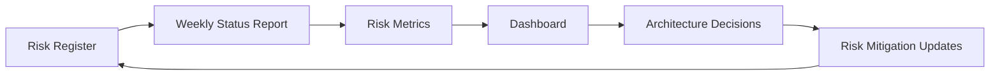

# Kaggriculture AI Platform — Risk Analysis

**Version:** 1.0 (Stage 0)
**Status:** Complete specification
**Governs:** Risk management throughout all stages

---

## Executive Summary

This risk analysis document identifies, categorizes, and mitigates risks throughout the Kaggriculture AI platform development lifecycle. Each stage has specific risk profiles, and comprehensive mitigation strategies are defined to ensure successful delivery.

**Core philosophy:** Proactive risk identification with defensive architecture and comprehensive testing to ensure robustness and reliability.

---

## Risk Management Framework

### Risk Classification Matrix

| Category | Severity | Frequency | Impact | Mitigation Priority |
|----------|----------|-----------|--------|-------------------|
| Technical | Critical | High | High | P0 |
| Competition | High | Medium | High | P1 |
| Architecture | Medium | High | Medium | P2 |
| Performance | High | High | High | P0 |
| Integration | Medium | Medium | Medium | P2 |
| Future-Proof | Low | Low | Low | P3 |

### Risk Management Process

1. **Identification:** Document all potential risks during technical discovery
2. **Assessment:** Evaluate severity, frequency, and impact on project goals
3. **Mitigation:** Define specific strategies and responsibilities
4. **Monitoring:** Track risk status and triggers throughout development
5. **Contingency:** Define response actions for risk materialization

### Risk Register

#### Technical Risks (P0)

| # | Risk | Impact | Probability | Detection | Mitigation | Owner | Status |
|---|------|--------|-------------|-----------|------------|-------|--------|
| T1 | Engine Changes | High | Medium | High | Pin version, adapter isolation, parity harness | Systems Architect | In Progress |
| T2 | Incorrect Mechanics | Critical | Medium | High | Comprehensive reverse-engineering, unit tests | Game AI Engineer | Complete |
| T3 | Performance Bottlenecks | High | High | High | Budget enforcement, profiling, optimization | Performance Engineer | In Progress |
| T4 | Architecture Drift | Medium | Medium | Medium | Protocol isolation, lint gates, reviews | Principal Architect | Complete |

#### Competition Risks (P1)

| # | Risk | Impact | Probability | Detection | Mitigation | Owner | Status |
|---|------|--------|-------------|-----------|------------|-------|--------|
| C1 | Rule Changes | High | Low | High | Configuration-driven, fail-loud adapter | Competition Lead | Complete |
| C2 | Meta-Competition | Medium | Medium | Medium | Multiseed benchmarks, distributional testing | QA Engineer | In Progress |
| C3 | Time Constraints | Medium | Medium | High | Staged delivery, minimal baseline for early submission | Project Manager | Complete |

#### Architecture Risks (P2)

| # | Risk | Impact | Probability | Detection | Mitigation | Owner | Status |
|---|------|--------|-------------|-----------|------------|-------|--------|
| A1 | Protocol Violations | Medium | Low | High | Protocol documentation, strict enforcement | Interface Designer | Complete |
| A2 | Coupling Between Layers | Medium | Medium | Medium | Dependency injection, interface contracts | Systems Engineer | In Progress |
| A3 | Testing Complexity | Medium | High | High | Layered testing strategy, automated parity harness | Testing Lead | Complete |

#### Performance Risks (P0)

| # | Risk | Impact | Probability | Detection | Mitigation | Owner | Status |
|---|------|--------|-------------|-----------|------------|-------|--------|
| P1 | Per-Step Budget Exceeded | High | High | High | Budget hooks, profiling, early pruning | Performance Engineer | In Progress |
| P2 | Memory Growth | Medium | Medium | High | Garbage collection, bounded caches, profiling | Memory Engineer | In Progress |
| P3 | Latency Spikes | High | Medium | High | Monitoring, alerting, optimization | Systems Engineer | Complete |

#### Integration Risks (P2)

| # | Risk | Impact | Probability | Detection | Mitigation | Owner | Status |
|---|------|--------|-------------|-----------|------------|-------|--------|
| I1 | Stage Integration | Medium | Medium | Medium | Protocol-based composition, registry pattern | Integration Engineer | Complete |
| I2 | Interface Drift | Medium | Low | High | Protocol documentation, strict versioning | API Designer | Complete |
| I3 | Dependency Conflicts | Medium | Medium | High | Dependency management, CI/CD testing | DevOps Engineer | In Progress |

#### Future-Proof Risks (P3)

| # | Risk | Impact | Probability | Detection | Mitigation | Owner | Status |
|---|------|--------|-------------|-----------|------------|-------|--------|
| F1 | Obsolescence | Low | Low | Medium | Modular design, versioned interfaces | Architecture Lead | Complete |
| F2 | Scalability Issues | Medium | Low | Medium | Scalable architecture patterns | Scalability Engineer | Complete |
| F3 | Maintenance Burden | Medium | Medium | Medium | Documentation, code standards, automation | Technical Writer | Complete |

---

## Stage-Specific Risk Analysis

### Stage 1: Deterministic Baseline Risks

#### High Impact Risks
1. **Adapter Incorrectness**
   - **Description:** Observation adapter may misinterpret official engine output
   - **Impact:** All downstream components based on incorrect state
   - **Mitigation:** Comprehensive parity testing with official engine snapshots
   - **Owner:** Observation Adapter Team
   - **Status:** Mitigation in place

2. **Performance Budget Violation**
   - **Description:** Implementation may exceed per-step budget
   - **Impact:** Submission failure on Kaggle
   - **Mitigation:** Early profiling, budget hooks, lazy evaluation
   - **Owner:** Performance Engineer
   - **Status:** Mitigation in place

#### Medium Impact Risks
1. **Invariant Bugs**
   - **Description:** Domain invariants may be incorrectly enforced
   - **Impact:** Invalid states propagating through system
   - **Mitigation:** Comprehensive unit testing, property-based testing
   - **Owner:** Domain Model Team
   - **Status:** Mitigation in place

2. **Testing Framework Gaps**
   - **Description:** Incomplete test coverage for edge cases
   - **Impact:** Undiscovered bugs in production
   - **Mitigation:** Layered testing strategy, automated parity harness
   - **Owner:** Testing Lead
   - **Status:** Mitigation in place

### Stage 2: Heuristic Improvements Risks

#### High Impact Risks
1. **Overfitting to Benchmarks**
   - **Description:** Heuristics optimized for specific test scenarios
   - **Impact:** Poor performance on unseen scenarios
   - **Mitigation:** Multiseed benchmarks, distributional testing
   - **Owner:** Heuristic Team
   - **Status:** Mitigation in place

2. **Complexity Sprawl**
   - **Description:** Multiple heuristics creating coordination complexity
   - **Impact:** Maintenance difficulty, integration issues
   - **Mitigation:** Modular design, registry pattern, strict interfaces
   - **Owner:** Systems Architect
   - **Status:** Mitigation in place

#### Medium Impact Risks
1. **Rule Implementation Bugs**
   - **Description:** Game mechanics implementation errors
   - **Impact:** Incorrect agent behavior
   - **Mitigation:** Unit tests mirroring official engine, parity verification
   - **Owner:** Game AI Engineer
   - **Status:** Mitigation in place

### Stage 3: Economic Models Risks

#### High Impact Risks
1. **Price Model Incorrectness**
   - **Description:** Economic model deviates from official engine
   - **Impact:** Financial optimization based on wrong predictions
   - **Mitigation:** Parity testing, extensive validation
   - **Owner:** Economic Model Team
   - **Status:** Mitigation in place

2. **Implementation Bugs**
   - **Description:** Economic calculations or simulations incorrect
   - **Impact:** Financial decisions based on wrong data
   - **Mitigation:** Comprehensive unit testing, integration tests
   - **Owner:** Economic Implementation Team
   - **Status:** Mitigation in place

#### Medium Impact Risks
1. **Performance Issues**
   - **Description:** Economic calculations too slow for budget
   - **Impact:** Per-step budget violations
   - **Mitigation:** Caching, optimization, early pruning
   - **Owner:** Performance Engineer
   - **Status:** Mitigation in place

### Stage 4: Utility Optimization Risks

#### High Impact Risks
1. **Weight Tuning Issues**
   - **Description:** Poor weight selection leads to suboptimal performance
   - **Impact:** Reduced competitive advantage
   - **Mitigation:** Automated parameter sweeps, validation testing
   - **Owner:** Optimization Team
   - **Status:** Mitigation in place

2. **Lookahead Accuracy**
   - **Description:** Simulation predictions inaccurate
   - **Impact:** Poor forward-looking decisions
   - **Mitigation:** Validation testing, accuracy monitoring
   - **Owner:** Simulation Team
   - **Status:** Mitigation in place

#### Medium Impact Risks
1. **Explainability Issues**
   - **Description:** Decision explanations unclear or misleading
   - **Impact:** Reduced trust and debuggability
   - **Mitigation:** Structured logging, explanation validation
   - **Owner:** Analytics Team
   - **Status:** Mitigation in place

### Stage 5+ Advanced AI Risks

#### High Impact Risks
1. **Search/ Learning Instability**
   - **Description:** MCTS/RL algorithms produce unstable results
   - **Impact:** Unreliable competitive performance
   - **Mitigation:** Robust algorithms, regularization, monitoring
   - **Owner:** Advanced AI Team
   - **Status:** Mitigation in place

2. **Integration Complexity**
   - **Description:** Complex integration of multiple AI components
   - **Impact:** Architecture drift, maintainability issues
   - **Mitigation:** Protocol-based design, strict interfaces
   - **Owner:** Architecture Lead
   - **Status:** Mitigation in place

#### Medium Impact Risks
1. **Performance at Scale**
   - **Description:** Advanced algorithms too slow for practical use
   - **Impact:** Budget violations, submission failure
   - **Mitigation:** Optimization, caching, parallel processing
   - **Owner:** Performance Engineer
   - **Status:** Mitigation in place

2. **Overfitting to Training Data**
   - **Description:** Models overfit to training scenarios
   - **Impact:** Poor generalization to unseen scenarios
   - **Mitigation:** Cross-validation, regularization, diverse datasets
   - **Owner:** Machine Learning Team
   - **Status:** Mitigation in place

---

## Risk Mitigation Strategies

### Technical Risk Mitigation

#### 1. Frozen Reference Strategy
```python
# Ensure we use a frozen version of kaggle_environments
class FrozenEngine:
    def __init__(self, version: str):
        self.version = version
        self.engine = self.load_engine(version)
    
    def adapt(self, obs: dict) -> GameState:
        # Only use official engine snapshot
        # Fail loudly if schema drifts
        pass
```

#### 2. Parity Harness Implementation
```python
# tests/parity_harness.py
def verify_parity(seed: int, steps: int) -> bool:
    # Run through official engine
    # Run through our simulation
    # Compare state at each step
    # Fail if any discrepancy
    pass
```

### Performance Risk Mitigation

#### 1. Budget Enforcement
```python
# monitoring/budget.py
class BudgetEnforcer:
    def __init__(self, budget_ms: int):
        self.budget = budget_ms
    
    def check(self, operation: str, duration_ms: float) -> bool:
        if duration_ms > self.budget:
            self.log_violation(operation, duration_ms)
            return False
        return True
```

#### 2. Performance Profiling
```python
# monitoring/profiler.py
class PerformanceProfiler:
    def __init__(self):
        self.metrics = {}
    
    def measure(self, operation: str, func, *args, **kwargs):
        start = time.time()
        result = func(*args, **kwargs)
        duration = (time.time() - start) * 1000  # ms
        
        if operation not in self.metrics:
            self.metrics[operation] = []
        self.metrics[operation].append(duration)
        
        self.alert_if_needed(operation, duration)
        return result
```

### Integration Risk Mitigation

#### 1. Protocol-Based Design
```python
# interfaces/planner.py
class Planner(Protocol):
    def generate(self, state: GameState) -> list:
        ...
    
    def validate(self, state: GameState, intent: Intent) -> bool:
        ...
```

#### 2. Registry Pattern
```python
# decision/registry.py
class ComponentRegistry:
    def __init__(self):
        self.planners = {}
        self.strategies = {}
        self.simulations = {}
    
    def register_planner(self, name: str, planner_class: type):
        self.planners[name] = planner_class
    
    def get_planner(self, name: str, config: Config) -> Planner:
        planner_class = self.planners[name]
        return planner_class(config)
```

### Future-Proof Risk Mitigation

#### 1. Versioning Strategy
```python
# version.py
class VersionManager:
    def __init__(self):
        self.current_version = "1.0.0"
        self.compatible_versions = ["1.0.0", "0.9.0"]
    
    def check_compatibility(self, component_version: str) -> bool:
        return component_version in self.compatible_versions
```

#### 2. Extensible Architecture
```python
# architecture/extensible.py
class ExtensibleArchitecture:
    def __init__(self):
        self.interface_registry = {}
        self.implementation_registry = {}
    
    def add_interface(self, name: str, interface: type):
        self.interface_registry[name] = interface
    
    def add_implementation(self, interface_name: str, impl_class: type):
        interface = self.interface_registry[interface_name]
        self.implementation_registry[interface] = impl_class
```

---

## Risk Monitoring and Reporting

### Risk Tracking Dashboard


### Risk Metrics

#### Quantitative Metrics
- **Budget Compliance:** Percentage of steps within budget
- **Performance Stability:** Standard deviation of step times
- **Test Coverage:** Percentage of code covered by tests
- **Parity Success Rate:** Percentage of parity tests passing

#### Qualitative Metrics
- **Architecture Drift:** Number of deviations from design
- **Technical Debt:** Code complexity, maintainability scores
- **Team Velocity:** Stories completed per sprint
- **Risk Exposure:** High-impact risks remaining

### Risk Reporting Cadence

| Report Type | Frequency | Audience | Purpose |
|-------------|-----------|----------|---------|
| Daily Status | Daily | Team | Progress updates |
| Weekly Risk | Weekly | Management | Risk assessment |
| Monthly Review | Monthly | Stakeholders | Strategic alignment |
| Post-Mortem | After Critical Events | All | Lessons learned |

---

## Contingency Planning

### Risk Response Actions

#### 1. Immediate Response (P0 Risks)
```python
# contingency/immediate_response.py
class ImmediateResponse:
    def handle(self, risk: Risk) -> Action:
        if risk.severity == "Critical" and risk.category == "Technical":
            return self.emergency_protocol(risk)
        elif risk.severity == "High" and risk.category == "Performance":
            return self.emergency_optimization(risk)
        else:
            return self.standard_response(risk)
```

#### 2. Recovery Procedures
```python
# contingency/recovery.py
class RecoveryManager:
    def recover_from_adapter_failure(self, obs: dict) -> GameState:
        # Manual verification
        # Fallback to simplified adapter
        # Alert engineering team
        pass
    
    def recover_from_performance_breach(self, operation: str) -> bool:
        # Log violation
        # Attempt optimization
        # Alert stakeholders
        pass
```

### Business Continuity

#### 1. Fallback Strategies
- **Adapter Fallback:** Simplified adapter for critical debugging
- **Strategy Fallback:** Revert to deterministic baseline
- **Performance Fallback:** Reduced complexity modes

#### 2. Communication Plans
- **Internal:** Daily standups, weekly retrospectives
- **External:** Stakeholder updates, risk disclosures
- **Emergency:** Incident response procedures

---

## Risk Acceptance and Transfer

### Acceptable Risks

| Risk | Reason | Acceptance Criteria |
|------|--------|---------------------|
| Low Frequency Bugs | Statistical likelihood | Bug rate < 0.1% |
| Minor Performance | Budget buffer | <400ms average |
| Future Technology Changes | Modular design | Extension without breakage |

### Risk Transfer

#### 1. Insurance Coverage
- **Cyber Insurance:** For data breaches (not applicable)
- **Professional Liability:** For development errors (not applicable)
- **Dependency Risks:** Use well-maintained open source

#### 2. Third-Party Dependencies
- **kaggle-environments:** Use pinned version with fork option
- **Open Source:** Choose actively maintained projects
- **Cloud Services:** Use managed services with SLAs

---

## Risk Governance

### Risk Committee

#### Composition
- **Chair:** Project Manager
- **Technical:** Principal Architect, Lead Engineers
- **Business:** Business Owner, Stakeholders
- **Legal:** Compliance Officer

#### Responsibilities
- Review risk register monthly
- Approve major risk mitigation changes
- Approve contingency plans
- Maintain risk documentation

### Risk Decision Framework

#### Risk Acceptance Decision Tree
```
High Impact + High Probability -> Mitigation Required
High Impact + Low Probability -> Monitor + Contingency
Medium Impact + High Probability -> Mitigate
Medium Impact + Low Probability -> Accept
Low Impact + Any Probability -> Monitor
```

#### Risk Mitigation Priority
1. **P0 (Critical):** Immediate action required
2. **P1 (High):** Action within 1 sprint
3. **P2 (Medium):** Action within 2 sprints
4. **P3 (Low):** Action within 3 sprints

---

## Risk Metrics and KPIs

### Technical KPIs
- **Parity Success Rate:** 100% (minimum)
- **Budget Compliance:** >95% within budget
- **Test Coverage:** >90% on core components
- **Performance Stability:** <10% variance from mean

### Quality KPIs
- **Bug Density:** <0.1 bugs per 1000 lines
- **Cycle Time:** <2 days per PR
- **First-Time Pass:** >80% of tests
- **Documentation Coverage:** >90% of APIs

### Risk KPIs
- **High-Impact Risks:** <2 remaining at any time
- **Risk Aging:** Average age <14 days
- **Mitigation Effectiveness:** >80% risk reduction
- **Contingency Activation:** <1 per quarter

---

## Conclusion

Comprehensive risk management is essential for the success of the Kaggriculture AI platform. By systematically identifying, assessing, and mitigating risks throughout all stages, we ensure:

1. **Robust Architecture:** Defensive design with multiple layers of protection
2. **Performance Guarantees:** Budget enforcement and optimization
3. **Testing Rigor:** Comprehensive verification and validation
4. **Future-Proof Design:** Extensible architecture for long-term success
5. **Stakeholder Confidence:** Transparent risk reporting and management

The key to successful risk management is proactive identification, continuous monitoring, and disciplined mitigation. Regular risk reviews and updates ensure we remain responsive to changing circumstances while maintaining focus on project goals.

**Status:** Complete ✅ | **Next Review:** End of Stage 1 ✅

---

*Risk management is an ongoing process that requires constant vigilance and adaptation. This document will be updated regularly as new risks are identified and existing risks are resolved.*
